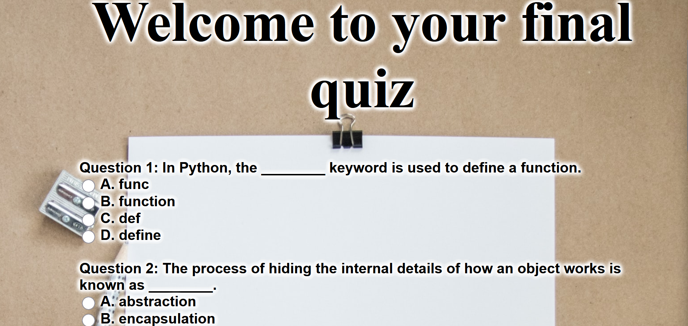
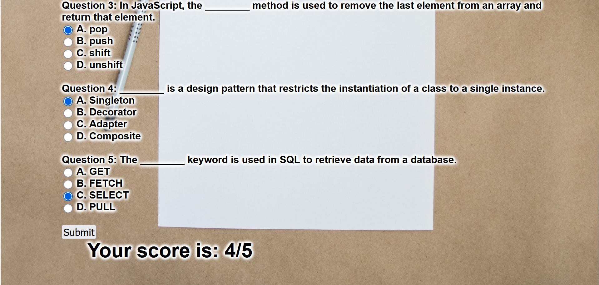

# Small Quiz Application

## Overview
This is a simple yet effective quiz application developed using HTML, CSS, JavaScript, and XML. The application loads quiz data from an XML file, presents it to the user, and then evaluates the answers.

## Technologies Used
- HTML
- CSS
- JavaScript
- XML

## How It Works
1. The `loaddata()` function is called when the page loads. It sends an AJAX request to fetch the quiz data from the XML file.
2. The `displayData()` function is called when the data is successfully fetched. This function creates a dynamic HTML quiz based on the data from the XML file.
3. As the user selects answers, the `answer()` function is called. This function checks whether the selected answer is correct and updates the `answered` object accordingly.
4. Once the user clicks the "Submit" button, the `showScore()` function is called to calculate and display the total score.

## Project Structure
- `index.html`: The main HTML file.
- `quiz.css`: The CSS file for styling the HTML page.
- `quiz.js`: The JavaScript file containing the logic for loading quiz data, handling user input, and calculating the score.
- `FinalQuiz.xml`: The XML file containing the quiz data.

## Usage
To use this application, simply open the `index.html` file in a web browser. Answer the quiz questions by selecting the appropriate radio button and then click the "Submit" button to see your score.

## Contributing
Contributions, issues, and feature requests are welcome! Feel free to check [issues page](https://github.com/your-username/your-repo/issues).

## License
Distributed under the MIT License. See `LICENSE` for more information.

